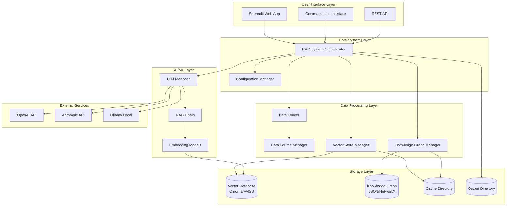
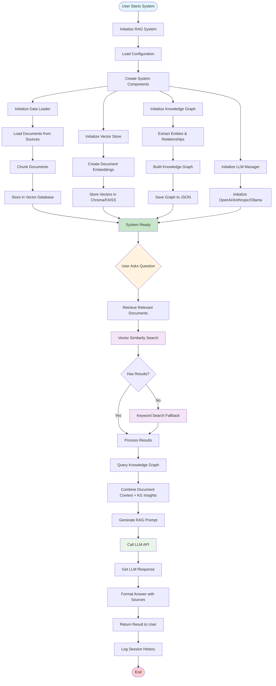
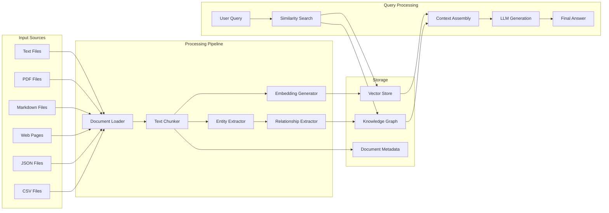
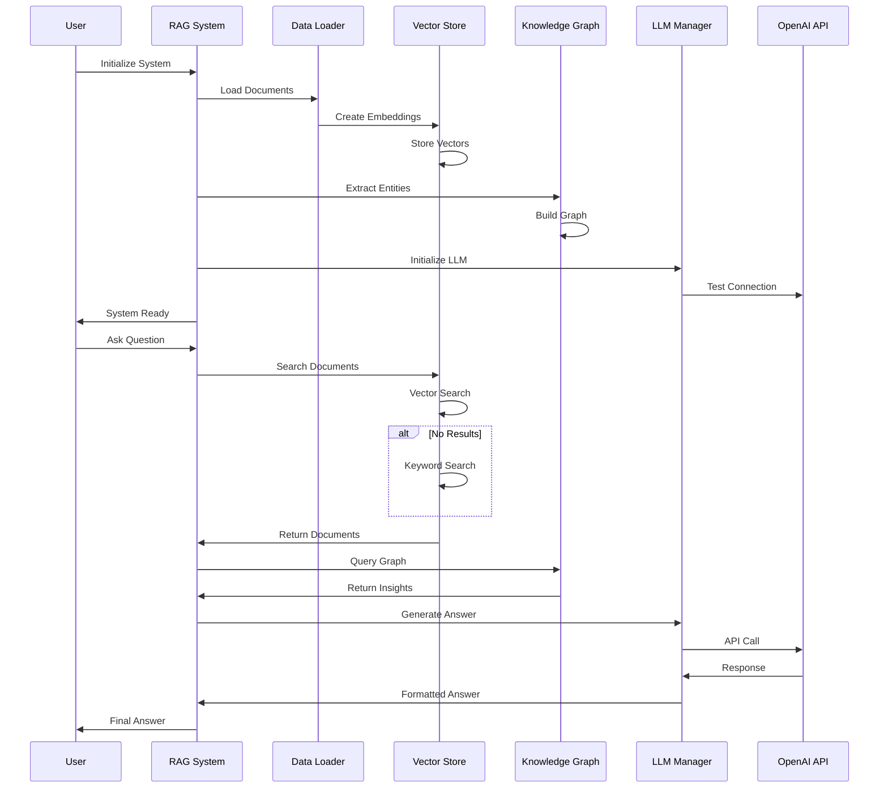
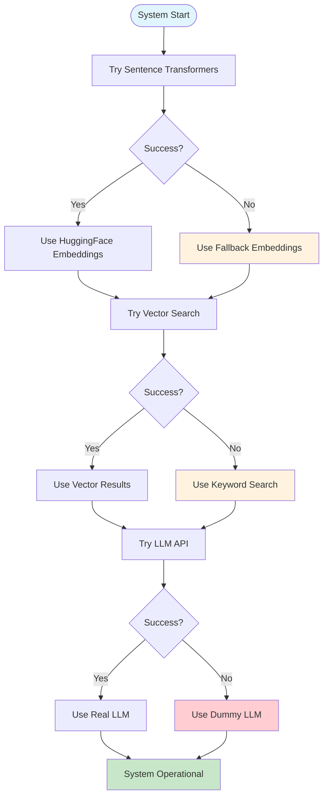
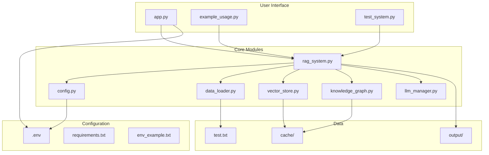

# RAG Knowledge Graph System - Flow Diagram

## System Architecture Overview

## Detailed System Flow

## Data Flow Diagram

## Component Interaction Flow

## Error Handling and Fallbacks

## File Structure and Dependencies

## Key Features and Capabilities

### ✅ **Implemented Features:**
- **Multi-format Document Loading**: TXT, PDF, MD, HTML, JSON, CSV
- **Intelligent Text Chunking**: Configurable chunk sizes and overlap
- **Vector Similarity Search**: ChromaDB and FAISS support
- **Keyword Search Fallback**: When vector search fails
- **Knowledge Graph Extraction**: Entity and relationship extraction
- **Multiple LLM Support**: OpenAI, Anthropic, Ollama
- **Robust Error Handling**: Multiple fallback mechanisms
- **Web Interface**: Streamlit-based UI
- **Session Management**: Query history and persistence
- **Extensible Architecture**: Easy to add new data sources and models

### 🔄 **System Workflow:**
1. **Initialization**: Load config, initialize components, load documents
2. **Document Processing**: Chunk, embed, and store documents
3. **Knowledge Extraction**: Build entity-relationship graph
4. **Query Processing**: Retrieve relevant context, generate answers
5. **Response Generation**: Combine context with LLM for final answer

### 🎯 **Use Cases:**
- **Document Q&A**: Ask questions about loaded documentation
- **Knowledge Discovery**: Explore entities and relationships
- **Research Assistant**: Multi-source information retrieval
- **Content Analysis**: Extract insights from large document collections 