# RAG Knowledge Graph System - Flow Diagram

## System Architecture Overview

## Detailed System Flow

## Entity & Relationship Extraction Flow

## Data Flow Diagram

## Component Interaction Flow

```mermaid
sequenceDiagram
    participant U as User
    participant R as RAG System
    participant D as Data Loader
    participant V as Vector Store
    participant K as Knowledge Graph
    participant N as Neo4j Manager
    participant J as JSON Manager
    participant L as LLM Manager
    participant O as OpenAI API
    
    U->>R: Initialize System
    R->>D: Load Documents
    D->>V: Create Embeddings
    V->>V: Store Vectors
    
    alt Knowledge Graph Type
        R->>N: Initialize Neo4j Manager
        N->>N: Check Neo4j Connection
        alt Neo4j Available
            N->>N: Use Neo4j Database
        else Neo4j Unavailable
            N->>N: Use In-Memory Fallback
        end
    else JSON Type
        R->>J: Initialize JSON Manager
    end
    
    R->>K: Extract Entities & Relationships
    K->>K: Single-Method Extraction (LLM → Semantic → Rule-based)
    K->>K: Store Results
    
    R->>L: Initialize LLM
    L->>O: Test Connection
    R->>U: System Ready
    
    U->>R: Ask Question
    R->>V: Search Documents
    V->>V: Vector Search
    alt No Results
        V->>V: Keyword Search
    end
    V->>R: Return Documents
    
    R->>K: Query Graph
    alt Neo4j Available
        K->>N: Query Neo4j
        N->>R: Return Insights
    else In-Memory
        K->>N: Query In-Memory
        N->>R: Return Insights
    else JSON
        K->>J: Query JSON
        J->>R: Return Insights
    end
    
    R->>L: Generate Answer
    L->>O: API Call
    O->>L: Response
    L->>R: Formatted Answer
    R->>U: Final Answer
```

## Error Handling and Fallbacks

## File Structure and Dependencies

## Key Features and Capabilities

### ✅ **Implemented Features:**
- **Multi-format Document Loading**: TXT, PDF, MD, HTML, JSON, CSV
- **Intelligent Text Chunking**: Configurable chunk sizes and overlap
- **Vector Similarity Search**: ChromaDB and FAISS support with keyword fallback
- **Dual Knowledge Graph Storage**: Neo4j (primary) + JSON (fallback)
- **In-Memory Fallback**: Neo4j unavailable → in-memory storage
- **Single-Method Extraction**: LLM → Semantic Search → Rule-based (priority-based)
- **Multiple LLM Support**: OpenAI, Anthropic, Ollama with fallback LLM
- **Robust Error Handling**: Multiple fallback mechanisms at every level
- **Web Interface**: Streamlit-based UI
- **Session Management**: Query history and persistence
- **Extensible Architecture**: Easy to add new data sources and models

### 🔄 **System Workflow:**
1. **Initialization**: Load config, initialize components, load documents
2. **Document Processing**: Chunk, embed, and store documents
3. **Knowledge Extraction**: Single-method entity/relationship extraction
4. **Storage Selection**: Neo4j (if available) or in-memory fallback
5. **Query Processing**: Retrieve relevant context, generate answers
6. **Response Generation**: Combine context with LLM for final answer

### 🎯 **Use Cases:**
- **Document Q&A**: Ask questions about loaded documentation
- **Knowledge Discovery**: Explore entities and relationships
- **Research Assistant**: Multi-source information retrieval
- **Content Analysis**: Extract insights from large document collections
- **Graph Analytics**: Query and visualize knowledge graphs

### 🛡️ **Robustness Features:**
- **Graceful Degradation**: System works even when components fail
- **Multiple Fallbacks**: LLM → Semantic → Rule-based extraction
- **Storage Flexibility**: Neo4j → In-Memory → JSON storage
- **Error Recovery**: Automatic fallback to alternative methods
- **Offline Capability**: Works without external services (except LLM) 